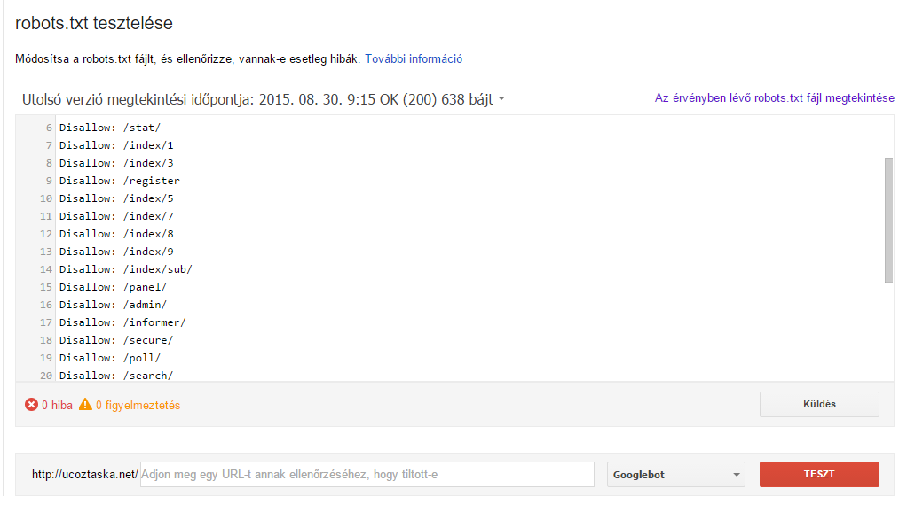
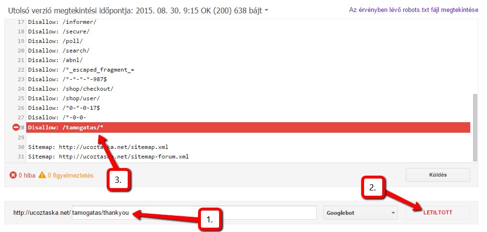
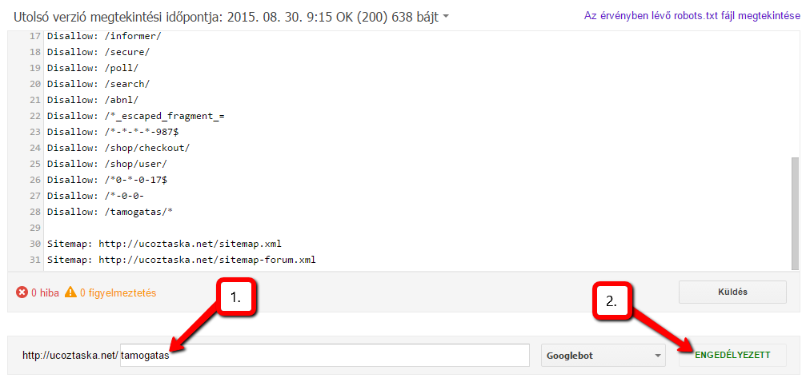

# A robots.txt-ről


A **robots.txt** az a fájl, amely meghatározza, hogy a weboldalad, valamint annak tartalma megjelenjen a keresőmotorokban.

## Miért annyira fontos?

A robots.txt a keresőoptimalizálás magja. Innen indul minden, mivel ez engedi meg a keresőmotoroknak, hogy indexeljék a weboldalad. Ez határozza meg, hogy mi legyen indexelve és mi nem.

## A uCoz rendszerben létrehozott weboldalakon van robots.txt fájl?

Persze hogy van. Ellenkező esetben ellent mondana a logikának. Az egyetlen korlátozás - ami az összes ingyenes weboldalszerkesztőnél jelen van, az az, hogy a honlap létrehozásától számított 30 napig karanténban van, tehát nem használható. 30 nap után (vagy egy fizetéses szolgáltatásra való előfizetés után) automatikusan kilép a karantén-időszakból, a keresőmotorok pedig elkezdhetik az indexelést a honlapon.

## Hol helyezkedik el?

A robots.txt a weboldalad gyökérkönyvtárában található, tehát ha a weboldalad URL címe után odaírod, hogy `/robots.txt`, már láthatod is a fájlt. 

Ezt a fájlt ugyan nem láthatod a Fájlkezelőben, de ne aggódj, attól függetlenül még létezik.
Hogy néz ki?

Amennyiben a weboldal még a 30 napos karanténidőszakban van, a fájl hasonlóképpen néz ki:

```
User-agent: *
Disallow: /
```

 - **User-agent: \*** — Azon keresőmotorokat jelöli, amelyekre a robots.txt bejegyzései érvényesülnek. A csillag karakter az összes keresőmotort jelenti.
 - **Disallow: /** — Az összes URL indexelésének letiltása.

A karanténidőszak után pedig már terjedelmesebb a fájl, és már szerkeszthetjük is, azáltal, hogy feltöltünk egy ugyanilyen nevű fájlt a fájlkezelőbe, de természetesen az eredeti fájl tartalmával és a módosításokkal. **Nem ajánlott lecserélni az alap értékeket**, mivel ezek alapból megfelelő módon vannak optimalizálva. Az alapfájl így néz ki:

```
User-agent: *
Allow: /*?page
Allow: /*?ref=
Allow: /stat/dspixel
Disallow: /*?
Disallow: /stat/
Disallow: /index/1
Disallow: /index/3
Disallow: /register
Disallow: /index/5
Disallow: /index/7
Disallow: /index/8
Disallow: /index/9
Disallow: /index/sub/
Disallow: /panel/
Disallow: /admin/
Disallow: /informer/
Disallow: /secure/
Disallow: /poll/
Disallow: /search/
Disallow: /abnl/
Disallow: /*_escaped_fragment_=
Disallow: /*-*-*-*-987$
Disallow: /shop/checkout/
Disallow: /shop/user/
Disallow: /*0-*-0-17$
Disallow: /*-0-0-

Sitemap: http://forum.ucoz.hu/sitemap.xml
Sitemap: http://forum.ucoz.hu/sitemap-forum.xml
```

 - **User-agent: \*** — A bejegyzések az összes keresőrobotra érvényesek.
 - **Allow: /*?page** — A bejegyzések listájának az oldalait (oldalválasztó) engedélyezi.
 - **Allow: /*?ref=** — A közösségi oldalakból származó referenciális linkek indexelését engedélyezi.
 - **Allow: /stat/dspixel** — A uCoz alapértelmezett statisztikájának indexelését engedélyezi.
 - **Disallow: /*?** — A paraméteres URL-ekk indexelését akadályozza meg.
 - **Disallow: /stat/** — A statisztika oldalának indexelését tiltja meg.
 - **Disallow: /index/1** — A belépési oldalt tiltja le.
 - **Disallow: /index/3** — A regisztrációs oldalt tiltja le.
 - **Disallow: /register** — Szintén a regisztrációs oldal letiltására szolgál.
 - **Disallow: /index/5** — A jelszó-emlékeztető szkript oldalának indexelését tiltja le.
 - **Disallow: /index/7** — Az avatar kiválasztásának oldalát tiltja le.
 - **Disallow: /index/8** — A felhasználói profil indexelésének letiltása.
 - **Disallow: /index/9** — A hírnévtörténet szkriptjének oldalát tiltja le.
 - **Disallow: /index/sub/** — A rendszer URL-eket tiltja le.
 - **Disallow: /panel/** — A vezérlőpult oldalának indexelését tiltja le.
 - **Disallow: /admin/** — Szintén a vezérlőpult oldalára utal.
 - **Disallow: /informer/** — Az informer-szkriptek könyvtárának indexelését tiltja le.
 - **Disallow: /secure/** — A biztonsági kód (CAPTCHA) könyvtárának letiltása.
 - **Disallow: /poll/** — A kérdőívek könyvtárának letiltása.
 - **Disallow: /search/** — A honlap keresőoldalának letiltása.
 - **Disallow: /abnl/** — A rendszer URL-eket tiltja le.
 - **Disallow: /*_escaped_fragment_=** — További rendszer-URL tiltás.
 - **Disallow: /\*-\*-\*-\*-987$** — Az anyag hozzászólásainak feed-könyvtárát tiltja le (A honlap hírei és Blog).
 - **Disallow: /shop/checkout/** — Az uShop fizetési oldalát tiltja le.
 - **Disallow: /shop/user/** — Az uShop felhasználói profilok indexelésének tiltása.
 - **Disallow: /\*0-\*-0-17$** — További rendszer URL tiltás.
 - **Disallow: /*-0-0-** — A felhasználó anyagainak, anyag-hozzáadás, fórumszabályzat, fórumtagok, stb. oldalának letiltására szolgál.

## Oldaltérkép

A robots.txt tartalmazza az oldaltérképekhez vezető útvonalakat is a legutolsó két sorban:

```
Sitemap: http://forum.ucoz.hu/sitemap.xml
Sitemap: http://forum.ucoz.hu/sitemap-forum.xml
```

Az első az általános oldaltérkép URL-je, a második pedig a fórum oldaltérképe. Ezeket változatlanul kell hagyni!

## Módosíthatok valamit a fájlban? 

Mint előbb is mondtuk, ez bővíthető saját elemekkel, viszont **a rendszer alap kódjait nagyon nem ajánlott lecserélni, törölni, stb**. A saját bejegyzések hozzáadását az utolsó Disallow után kell beszúrni egy új sorba.

Vegyük a uCoz Táska példáját: Van egy támogatás oldalunk. Ez indexelve marad, tehát hagyjuk, hogy a keresőmotorok indexeljék. Ennek az oldalnak viszont van két "aloldala" - egy oldal, amelyre a látogató át lesz irányítva, amennyiben sikeresen támogatott minket egy kis összeggel, valamint egy másik oldal, amelyre akkor lesz átirányítva, amennyiben visszavonta a PayPal-es tranzakciót. Mi az utóbbi kettőt nem szeretnénk indexelni.

Ezt a következőképpen oldottuk meg:

```
Disallow: /tamogatas/thankyou
Disallow: /tamogatas/cancel
```

Viszont van egy egyszerűbb megoldás is. A **csillag karakter** használata. Ugyanis a csillag azt jelöli, hogy bármi jöhet a helyébe. Így mivel az URL cím alatt mindkét oldal hasonló formájú, felírhatjuk így is:

```
Disallow: /tamogatas/*
```

Ugyanakkor hozzászólásokat is írhatunk a fájlba, amelyeket a jobb olvashatóság kedvéért használhatunk, valamint azért, hogy könnyebben megkapjunk valamit. Ezeket egy **#** jel után kell írni, a következő formában:

```
Disallow: /tamogatas/* # A thankyou és cancel oldalak indexelésének letiltása
```

## A robots.txt és URL-ek tesztelése

A robots.txt fájl, valamint az URL-ek teszteléséhez a Google Webmestereszközök a megfelelő megoldás. Amennyiben már hozzáadtuk weboldalunkat a Google Webmestereszközökhöz (Search Console), a dolgunk nagyon könnyű lesz. Amennyiben még nem, hozzá kell adnunk.

A tesztelési eszköz [itt található](https://www.google.com/webmasters/tools/robots-testing-tool). Itt ki kell választanunk a legördülő listából a weboldalunkat, és már láthatjuk is a robots.txt fájlunk elemzését.



Az oldal alsó részén, a beviteli mező előtt láthatjuk, hogy van e érvényben levő hiba vagy figyelmeztetés, ugyanakkor amennyiben lenne, a fájlban színessel ki lenne emelve. 

URL-ek indexelési állapotát (lehet-e indexelni vagy sem) is tesztelhetjük ezzel az eszközzel. Csak be kell illesztenünk a weboldalunk URL-címe **után** levő részt, **per ( / )** nélkül.

Vegyünk egy példát és térjünk vissza a uCoz Táska Támogatás oldalára. Az előbb megadtuk, hogy ne lehessen indexelni a támogatási oldal két aloldalát. Ezt tesztelhetjük is:



Ugyanilyen a helyzet a második oldallal is. Viszont most próbáljuk meg maga a támogatási oldalt tesztelni:



Tehát láthatjuk, hogy tökéletesen megkaptuk azt amit szerettünk volna.