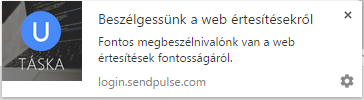
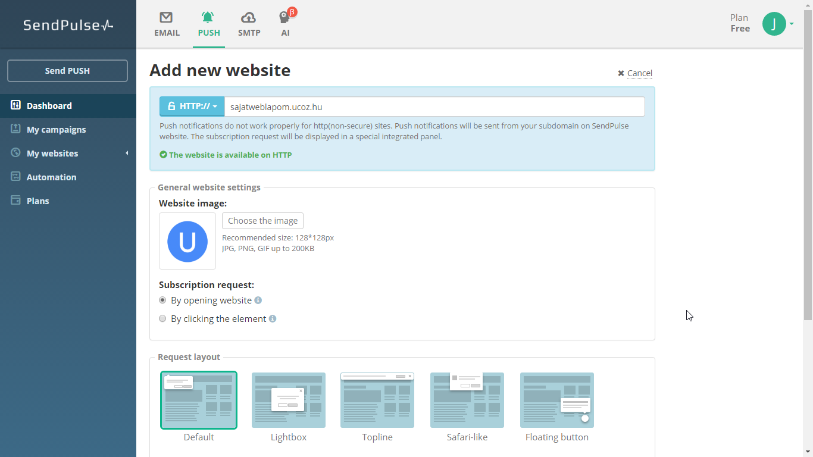

# Beszélgessünk a push értesítésekről

Push értesítések... Számos weboldal használ ilyeneket, hogy értesítse látogatóit az újdonságokról. Megmutatjuk, hogyan lehet neked is egy! 

## Mik a push értesítések?

Véleményem szerint a push értesítések az egyik legjobb mód arra, hogy visszahozzuk a látogatóinkat az oldalra, ha valami újat tettünk közzé, mivel a felhasználónak/vendégnek csupán az a dolga, hogy rákattint egy gombra. Még e-mail címet sem kell beírnia, és máris megkaphat minden hírt az oldalról. Egy push értesítés a böngésző jobb alsó sarkában megjelenő értesítés, melyre rákattintva az emberkék át lesznek irányítva a megadott oldalra. A push értesítéseket a legtöbb modern böngésző támogatja, többek között a Google Chrome (és egyéb Chromium alapú böngészők), Mozilla Firefox és Safari. Ezek az értesítések bármikor megjelenhetnek, amikor a böngésző be van kapcsolva, vagy akár annak bekapcsolásakor is.

## SendPulse

A **[SendPulse](https://sendpulse.com/)** egy olyan szolgáltatás, melynek segítségével ingyen létrehozhatsz korlátlan számú push értesítést a weboldaladhoz, akármennyi feliratkozó számára! A szolgáltatás egyelőre csak angol, orosz és ukrán nyelven érhető el, viszont minimális angoltudással elsajátíthatod a rendszert. A SendPulse mindezek mellett e-mail marketing-megoldásokat is nyújt, de ebben a cikkben szigorúan a push értesítésekről ejtünk szót. 

Regisztráció után csak hozzá kell adnunk a weboldalunkat a rendszerhez. Ehhez a Push fülön található Add new website gombra kell kattintanunk. A megjelenő oldalon meg kell adnunk a weboldalunk URL címét, a protokollt (ami elég valószínű, hogy HTTP), a képet, ami a push értesítésben megjelenik, valamint a feliratkozási üzenet viselkedését és elhelyezkedését (mi a By opening website alatt a Default opciót ajánljuk és használjuk).

Miután hozzáadtuk a honlapot, mindössze arra kell várjunk, hogy a felhasználók/vendégek feliratkozzanak, és már ki is küldhetjük az értesítéseket a Send PUSH vagy Create a push campaign gombra való kattintással. Kiküldés előtt ajánlott ellenőrizni, hogyan fog kinézni a kiküldendő értesítés - erre szolgál a Send a test push hivatkozás.

## GYIK

**Van értelme a hírleveleknek ha itt vannak a push értesítések?**
Igen, mivel sok esetben biztosabb az e-mail. A push értesítések nem működnek régebbi böngészők, illetve mobiltelefonok esetében, az e-mail fiókunkat viszont minden eszközről elérhetjük. Az e-mailnek még annyi előnye van, hogy az még jobban személyre szabható, több tartalmat lehet belefoglalni, valamint majdnem biztos, hogy előbb vagy utóbb a felhasználók úgyis észreveszik. 

**Hogyan tüntethetem el a SendPulse reklámot?**
Ingyen sehogy, frissítened kell a White Label csomagra ($50/hónap) a SendPulse reklám eltüntetéséhez, bár nem hinném, hogy egy apró szöveg bárkit is zavarna.

**Hogyan iratkozhatnak le a feliratkozók a push értesítésekről?**
Mindössze le kell tiltaniuk őket a böngészőjükben. A SendPulse előállott [egy kis tutorial](https://support.sendpulse.com/466288-How-to-unsubscribe-from-push-notifications)-lal ezzel kapcsolatban. 
