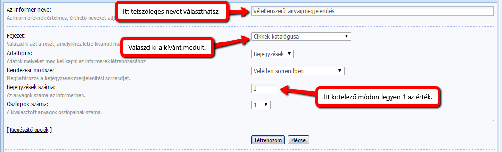

# Link véletlenszerű anyagra

A funkció segítségével könnyedén helyezhetsz el a weboldalad bármelyik részére egy linket, melyre ha a látogatók rákattintanak, a honlapodon levő egyik anyagra lesznek átirányítva, véletlenszerűen. Ilyesmit lehet látni a [Gyakori Kérdések](https://www.gyakorikerdesek.hu/) oldalán, például.

A dolgunk egyszerű lesz – Informert kell használnunk.

1. Menjünk a Vezérlőpultba, majd az **Eszközök** menü **Informerek** elemére.

2. Hozzunk létre egy új informert az **Informer létrehozása** gombra kattintva.

3. Adjuk meg a következő paramétereket: 



4. Miután létrehoztuk az informert, kattintsunk a neve mellett található **Az informer sablonja** linkre.

5. Az ott látható kódot cseréljük le erre:

```html
<a href="$ENTRY_URL$">Véletlenszerű anyag megnyitása</a>
```

A Véletlenszerű anyag megnyitása szöveg helyett használhatsz más szöveget is, mint ahogy a mi esetünkben. Mi a Lepj meg formát használtuk. Ajánlott egy felhívó formát használni, hogy nagyobb legyen a kattintási esély. Nyugodtan használhatod a mi változatunkat is!

6. Kattints a **Mentés** gombra.

7. Illeszd be az informer kódját oda ahová akarod. Például ez lehet egy blokkban, fejlécben, egy oldalon, vagy akár a menüben, de fontos megjegyezni, hogy a uCoz alapértelmezett menüjében ezt nem lehet megjeleníttetni (csak saját készítésű HTML+CSS menük esetében).

A linkre való rámutatáskor a böngésző alján megjelenik a hivatkozás oldalának linkje. Ha (a stílus kedvéért) nem szeretnénk láthatóvá tenni az oldalra mutató linket, használjuk ezt a kódot az informer sablonjaként:

```html
<a href="javascript://" onclick="window.location = '$ENTRY_URL$';">Véletlenszerű anyag megnyitása</a>
```

Így most egyedül a forráskódban fog megjelenni a szerencsés link. 

*Az anyag megírásához inspirált: http://yraaa.ru/scripts/otkryt-sluchajnyj-material-ucoz.*
