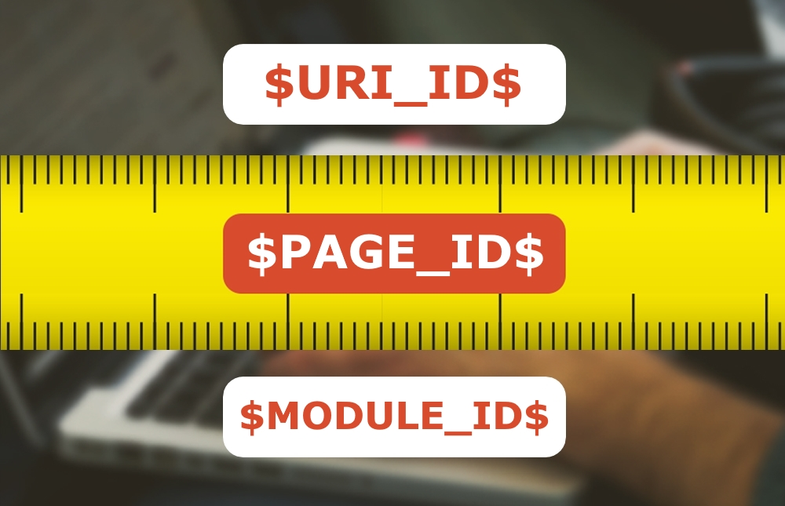
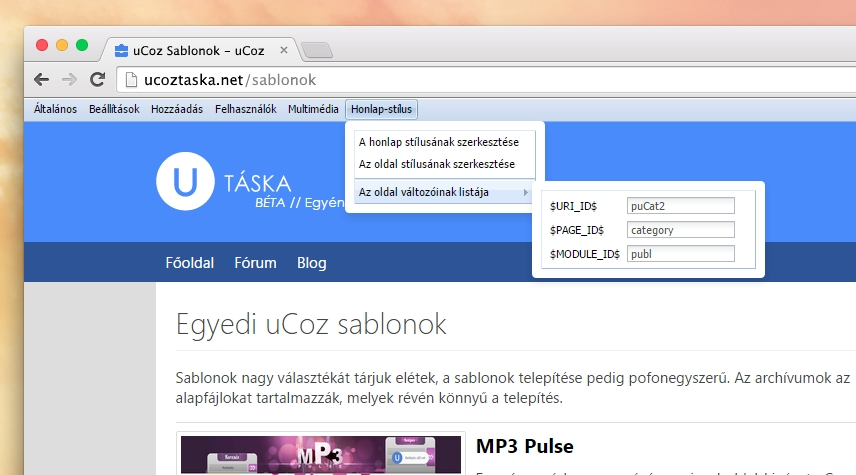

# Oldalváltozók és azok használata



A uCoz rendszer lehetőségei egyik CMS-rendszeréhez sem hasonlíthatóak. Ezt szeretnénk a mai napon is bebizonyítani! 

Minidig is szerettél volna valamit megjeleníteni egy adott oldalon, de a kódot csak egy olyan sablonba illesztheted amely több oldalhoz szól? Sokan azt mondják, hogy ez lehetetlen. Viszont tévednek, ez igenis lehetséges! Mai cikkünk keretében megmutatjuk, hogyan.

A uCoz rendszerben gyakorlatilag minden rendelkezik egy azonosítóval (ID). Ez lehet szám (például kategóriák, anyagok esetében) vagy karaktersorozat. A “minden”-be beletartozik a honlap összes oldala is.

A legtöbb oldal sablonja teljesen testreszabható a *Vezérlőpult >> Külalak vezérlése* oldalon, viszont bizonyos esetekben szeretnénk megjeleníteni valamit egy olyan oldalon, ahol nem tudunk szerkeszteni. 

Vegyük például azt az esetet, hogy csak egy bizonyos kategória keretén belül szeretnénk megjeleníteni egy szöveget. Erre használhatóak a **feltételes operátorok** és az **oldalváltozók**.

Nagyon egyszerű dolgunk lesz. Csak menjünk a kívánt kategória oldalára, majd az admin-sáv **Szerkesztő** vagy **Honlap-stílus** menüjéből mutassunk az **Oldal változóinak listája** elemre. 



Itt ezeket a kódokat láthatjuk. Íme azok jelentése:

 - **$URI_ID$** - a meglátogatott oldal pontos azonosítója. Ez akkor hasznos, amikor csupán egy adott oldalhoz szeretnénk valamit asszociálni, de külön rá nincs lehetőségünk a Külalak vezérlése oldalon, csupán egy globális blokkban.
 - **$PAGE_ID$** - a meglátogatott oldal típusának azonosítója. Ez akkor hasznos, amikor például egy globális blokkban szeretnénk valamit kiemelni, viszont az csak egy bizonyos oldaltípus esetében legyen látható. Ilyen oldaltípus például a kategóriák oldala, a témák oldala, az üzenet hozzáadásának űrlapja stb.
 - **$MODULE_ID$** - a modul azonosítója. Szintén globális blokkok esetében hasznos, amennyiben egy adott modul megtekintésekor szeretnénk valamit kiemelni.

Példánkhoz az **$URI_ID$** kell. Csak másoljuk ki, és illesszük be a következő formába, a kategória-anyagok listájának oldalába:

```html
<?if($URI_ID$='puCat2')?>megjelenítendő információ<?endif?>
```

Ez fordítva is igaz, ha csupán egy kategória számára nem szeretnénk megjeleníteni egy információt, használjuk ezt a kódot:

```html
<?ifnot($URI_ID$='puCat2')?>ez az információ az összes többi kategóriában látszik, csak a 2-es azonosítójú kategóriában nem<?endif?>
```

vagy akár ezt:

```html
<?if($URI_ID$!='puCat2')?>ez az információ az összes többi kategóriában látszik, csak a 2-es azonosítójú kategóriában nem<?endif?>
```

A két kód gyakorlatilag ugyanazt a célt szolgálja, viszont kinek melyik tetszik, azt használja.
